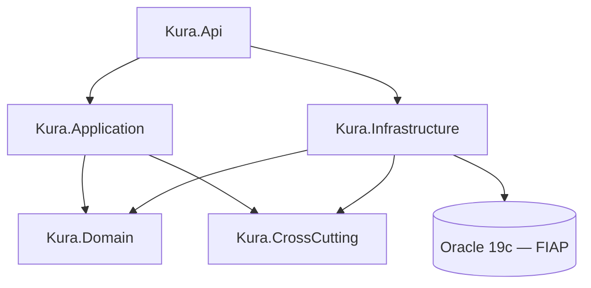

# KURA API — Backend Clínica


[](https://github.com/KURA-Clyvo/backend-clinica-dotnet/actions/workflows/ci.yml)

-blueviolet)

Hub clínico do ecossistema **Clyvo Vet** — sistema integrado de gestão veterinária desenvolvido como Challenge FIAP 2026. Expõe a API RESTful responsável pelo domínio clínico: prontuários, eventos, agenda, IoT de temperatura e integração com a IA Luna de triagem.

---

## Sumário

1. [Arquitetura](#arquitetura)
2. [Primeiros Passos](#primeiros-passos)
3. [Configuração de Ambiente](#configuração-de-ambiente)
4. [Execução Local](#execução-local)
5. [Execução via Docker](#execução-via-docker)
6. [Autenticação](#autenticação)
7. [Índice de Endpoints](#índice-de-endpoints)
8. [Health Checks, Observabilidade e Monitoramento](#health-checks-observabilidade-e-monitoramento)
9. [Testes](#testes)
10. [Índice de Artefatos — Avaliadores FIAP](#índice-de-artefatos--avaliadores-fiap)
11. [Variáveis de Ambiente](#variáveis-de-ambiente)
12. [Equipe](#equipe)

---

## Arquitetura

Clean Architecture em 4 camadas com separação estrita de responsabilidades:

```
Api  ──►  Application  ──►  Domain
 │                             ▲
 └──────  Infrastructure  ─────┘
```


```mermaid
graph TD
    A[Kura.Api] --> B[Kura.Application]
    A --> C[Kura.Infrastructure]
    B --> D[Kura.Domain]
    C --> D
    B --> F[Kura.CrossCutting]
    C --> F
    C --> E[(Oracle 19c — FIAP)]
```

| Camada | Responsabilidade |
|---|---|
| **Kura.Domain** | Entidades, interfaces de repositório, exceções de domínio. Zero dependências externas. |
| **Kura.Application** | Serviços de orquestração, DTOs, validadores FluentValidation. |
| **Kura.Infrastructure** | EF Core `KuraDbContext`, repositórios, configurações Fluent API, interceptors. |
| **Kura.Api** | Controllers HTTP, filtros de autenticação, middlewares. Nenhuma lógica de negócio. |
| **Kura.CrossCutting** | Preocupações transversais, que nenhuma camada "possui": hoje só o `ActivitySource` de tracing entre camadas (`KuraActivitySource`). Zero dependências externas, como o Domain — mas separado dele de propósito, porque o núcleo de domínio não deve saber que existe telemetria. |

### Padrões arquiteturais relevantes

- **Repository + Unit of Work** — `IRepository<T>` / `IUnitOfWork` definidos no Domain, implementados na Infrastructure. Um único `CommitAsync()` por operação de serviço.
- **Multi-tenancy implícita** — `IClinicaContext` injeta `ID_CLINICA` do JWT em `HasQueryFilter` global. Endpoints públicos recebem `IdClinicaFiltro = null`, contornando o filtro intencionalmente.
- **Soft delete** — todas as entidades herdam `EntidadeBase` (`StAtiva`, `DtCriacao`, `DtAtualizacao`). Filtro global em `StAtiva`.
- **Bool → CHAR(1)** — conversor global `BoolToSimNaoConverter` mapeia `bool`/`bool?` para `'S'`/`'N'` (schema Oracle).
- **Read-only via interceptor** — `ReadOnlyTablesInterceptor` rejeita qualquer `Add`/`Update`/`Delete` contra `ContaTutor` e `Consentimento` (domínio Java).
- **Concorrência otimista** — `Agendamento` usa coluna `NrVersion`; conflito retorna HTTP 409.

---

## Primeiros Passos

### Pré-requisitos

| Ferramenta | Versão mínima |
|---|---|
| .NET SDK | 10.0 |
| Docker + Docker Compose | 24.x |
| Oracle alcançável | Oracle XE local do `DevOps-Cloud` (`localhost:9092/XEPDB1`) |

> 🔴 **Não aponte a aplicação para `oracle.fiap.com.br`.** É infraestrutura **compartilhada e
> viva**: credencial errada gera `ORA-01017` a cada tentativa e, com o `restart` do container
> repetindo isso em laço, `ORA-01017` repetido vira `ORA-28000` (**conta bloqueada**) — já
> aconteceu neste projeto e travou a conta de toda a equipe. Use o Oracle XE local do
> `DevOps-Cloud`. Os exemplos deste README usam `localhost:9092/XEPDB1` por esse motivo.

### Clonar o repositório

```bash
git clone https://github.com/KURA-Clyvo/backend-clinica-dotnet.git
cd backend-clinica-dotnet
```

---

## Configuração de Ambiente

> **Política de segredos**: jamais commite credenciais. O arquivo `appsettings.Development.json` está no `.gitignore`. Use variáveis de ambiente ou o mecanismo de User Secrets do .NET para desenvolvimento local.

### Opção A — User Secrets (recomendado para desenvolvimento local)

```bash
dotnet user-secrets init --project src/Kura.Api
dotnet user-secrets set "ConnectionStrings:DefaultConnection" \
  "User Id=<YOUR_ORACLE_USER>;Password=<YOUR_ORACLE_PASSWORD>;Data Source=localhost:9092/XEPDB1" \
  --project src/Kura.Api
dotnet user-secrets set "Jwt:Key" "<YOUR_JWT_SECRET_MIN_32_CHARS>" --project src/Kura.Api
dotnet user-secrets set "Jwt:Issuer" "kura-api" --project src/Kura.Api
dotnet user-secrets set "Jwt:Audience" "kura-client" --project src/Kura.Api
dotnet user-secrets set "IoT:ApiKey" "<YOUR_IOT_API_KEY>" --project src/Kura.Api
dotnet user-secrets set "Luna:ApiKey" "<YOUR_LUNA_API_KEY>" --project src/Kura.Api
# Obrigatória para GET /health responder — sem ela o endpoint devolve 500 (ver §Testes/§Health).
dotnet user-secrets set "Luna:BaseUrl" "http://localhost:8000" --project src/Kura.Api
dotnet user-secrets set "Luna:InboundApiKey" "<YOUR_LUNA_INBOUND_API_KEY>" --project src/Kura.Api
dotnet user-secrets set "Daily:ApiKey" "<YOUR_DAILY_CO_API_KEY>" --project src/Kura.Api
```

### Opção B — `appsettings.Development.json` (local, nunca versionado)

Crie `src/Kura.Api/appsettings.Development.json`:

```json
{
  "ConnectionStrings": {
    "DefaultConnection": "User Id=<YOUR_ORACLE_USER>;Password=<YOUR_ORACLE_PASSWORD>;Data Source=localhost:9092/XEPDB1"
  },
  "Jwt": {
    "Key": "<YOUR_JWT_SECRET_MIN_32_CHARS>",
    "Issuer": "kura-api",
    "Audience": "kura-client",
    "ExpiryHours": 8
  },
  "IoT": { "ApiKey": "<YOUR_IOT_API_KEY>" },
  "Luna": {
    "ApiKey": "<YOUR_LUNA_API_KEY>",
    "BaseUrl": "http://localhost:8000",
    "InboundApiKey": "<YOUR_LUNA_INBOUND_API_KEY>"
  },
  "Daily": { "ApiKey": "<YOUR_DAILY_CO_API_KEY>" }
}
```

> `Luna:BaseUrl` é lida pelo health check da Luna e pelo client de transcrição. **Se faltar,
> a aplicação sobe normalmente e é `GET /health` que passa a devolver `500`** com
> `InvalidOperationException: Luna:BaseUrl not configured.` — medido. Ver
> [Health Checks](#health-checks-observabilidade-e-monitoramento).

### Opção C — `.env` para Docker Compose

```bash
cp .env.example .env
# edite .env e preencha os valores reais
```

---

## Execução Local

```bash
dotnet restore
dotnet build
dotnet run --project src/Kura.Api
# Swagger UI: http://localhost:5162/swagger  (apenas ambiente Development)
# Health:     http://localhost:5162/health
# Metrics:    http://localhost:5162/metrics
```

A porta vem do perfil `http` de `src/Kura.Api/Properties/launchSettings.json`
(`applicationUrl: http://localhost:5162`); o perfil `https` sobe também em `7112`. Para ignorar
os perfis e escolher a porta explicitamente, use
`dotnet run --no-launch-profile --project src/Kura.Api` com `ASPNETCORE_URLS`.

> ⚠️ `launchSettings.json` força `ASPNETCORE_ENVIRONMENT=Development`, e em `Development` o
> `Program.cs` executa o bloco de validação de migrations, que **abre conexão real** com o
> Oracle da connection string configurada. Confira para onde ela aponta **antes** de rodar —
> é exatamente esse caminho que já bloqueou a conta institucional.

🔴 **`dotnet run` exige um Oracle alcançável — não é opcional, e a falha não é graciosa.**
Medido nesta máquina, com a connection string apontada para uma porta morta: o processo
**termina no startup** com exceção não tratada e **nunca chega a escutar na porta**.

```
Unhandled exception. Oracle.ManagedDataAccess.Client.OracleException (0x80004005): ORA-50201: ...
 ---> OracleInternal.Network.NetworkException (0x80004005): ORA-50201: ...
 ---> OracleInternal.Network.NetworkException (0x80004005): ORA-12541: TNS: não há listener
   at Program.<Main>$(String[] args) in src/Kura.Api/Program.cs:line 136
```

Repare que o bloco de retry **não re-tentou**: nenhuma linha `"Oracle não disponível (ORA-…)"`
foi emitida. O motivo está detalhado em
[Cold start](#cold-start-no-compose--o-que-é-esperado-e-o-que-não-é-verdade) — o `.Number`
comparado pelo `when` pertence à `OracleException` externa (`ORA-50201`), e o código de rede
real vem numa `NetworkException` dois níveis abaixo.

Se você só quer rodar a **suíte de testes**, não precisa de Oracle nenhum — veja
[Testes](#testes).

---

## Execução via Docker

```bash
cp .env.example .env      # obrigatório: preencha os valores antes de subir
docker-compose up --build
# Swagger UI: http://localhost:8080/swagger
# Health:     http://localhost:8080/health
# Metrics:    http://localhost:8080/metrics
```

> 🔴 **O `cp .env.example .env` não é opcional.** Todas as variáveis do `docker-compose.yml`
> usam a forma `${VAR:?mensagem}`: sem o `.env` preenchido o Compose **aborta** com a mensagem
> da variável que faltou, em vez de subir o container com valor vazio. Isso é deliberado — a
> versão anterior deste arquivo renderizava `Password=;Data Source=oracle.fiap.com.br`, ou
> seja, usuário real e host vivo com senha vazia, que é o laço de `ORA-01017` que bloqueia a
> conta.

Este compose sobe **apenas a API**; ele não inclui banco. Aponte `ORACLE_DATA_SOURCE` para um
Oracle que você controle — o XE local do `DevOps-Cloud` (`localhost:9092/XEPDB1`) é o alvo
esperado. Para subir o ecossistema completo (Oracle XE + .NET + Java + Luna), use o
`docker compose` do repositório `DevOps-Cloud`, não este.

> 🔴 **Limitação conhecida deste `docker-compose.yml`: o `.env.example` traz 3 valores que o
> compose nunca repassa ao container** — `LUNA_BASE_URL`, `LUNA_INBOUND_API_KEY` e
> `STORAGE_BASE_PATH`, que a aplicação leria como `Luna__BaseUrl`, `Luna__InboundApiKey` e
> `Storage__BasePath`.
>
> ⚠️ Repare nos **dois** sistemas de nome: o `.env` usa `LUNA_BASE_URL`; a aplicação .NET lê
> `Luna__BaseUrl`. É o bloco `environment:` do serviço que liga um ao outro — e para estes 3 ele
> simplesmente **não tem a linha**. Por isso preencher o `.env` **não basta**. Medido:
> `docker compose --env-file .env config | grep -c Luna__BaseUrl` → **0**
> (contra **1** para `Luna__ApiKey` e `Daily__ApiKey`, que é o controle positivo de que o
> comando enxergaria a variável se ela estivesse lá).
>
> **Consequência esperada — inferida do código, não medida** (ninguém subiu este container com a
> imagem atual): o container sobe e `GET /health` responde **`500`** com
> `Luna:BaseUrl not configured.`, o mesmo sintoma descrito em
> [Health Checks](#health-checks-observabilidade-e-monitoramento) — aqui por omissão do compose,
> não por erro de quem configurou. A transcrição de áudio quebraria pela mesma razão, embora a
> exceção que aparece seja sempre a de `Luna:BaseUrl`: as duas chaves são lidas no mesmo
> registro, e essa é a primeira. `Storage__BasePath` é opcional e cai no default.
>
> **Saídas:** acrescente as 3 linhas ao bloco `environment:` do serviço, **ou** use o
> `docker compose` do `DevOps-Cloud`, que já as injeta. Este README **não** afirma que o compose
> daqui entrega um `/health` verde — porque ele não entrega.

---

## Autenticação

| Contexto | Mecanismo | Consumidor |
|---|---|---|
| Front da clínica | JWT Bearer — `Authorization: Bearer {token}` | Veterinários e gestores |
| Dispositivos IoT (ESP32) | API Key — `X-Api-Key: {key}` | Sensores de temperatura |
| IA Luna (Python) | API Key — `X-Api-Key: {key}` | Chatbot de triagem |

> A linha "IA Luna" acima documenta o par `Luna:ApiKey`/`LUNA_API_KEY` — a chave que a
> Luna manda no header **`X-Api-Key`** (a migração prevista na TASK-68 **já foi concluída**;
> `LunaApiKeyAuthFilter` lê `X-Api-Key` e nada mais) para
> autenticar suas chamadas *para* este backend (`GET /tutores/telefone/{numero}`,
> `POST /luna/interactions`, `POST /luna/triage` — TASK-67). **Não confundir** com
> `Luna:InboundApiKey`/`LUNA_INBOUND_API_KEY`, usada na direção oposta (este backend →
> Luna, `POST /transcricao`, FEAT-02). São duas chaves/direções diferentes mesmo
> compartilhando o prefixo `Luna:` na config.

### Fluxo de autenticação JWT

```
1. POST /api/v1/auth/register-clinica   →  cria clínica (sem token)
2. POST /api/v1/auth/login              →  retorna { "token": "..." }
3. Swagger → Authorize → Bearer {token}
```

```bash
TOKEN=$(curl -s -X POST http://localhost:8080/api/v1/auth/login \
  -H "Content-Type: application/json" \
  -d '{"dsEmail":"admin@clinica.com","dsSenha":"Senha123!"}' \
  | jq -r '.token')

curl -H "Authorization: Bearer $TOKEN" http://localhost:8080/api/v1/tutores
```

---

## Índice de Endpoints

### Auth

| Método | Rota | Descrição | Auth |
|---|---|---|---|
| POST | `/api/v1/auth/login` | Autenticação — retorna JWT | Público |
| POST | `/api/v1/auth/register-clinica` | Cadastro de nova clínica | Público |

### Clínicas

| Método | Rota | Descrição | Auth |
|---|---|---|---|
| GET | `/api/v1/clinicas/{id}` | Buscar clínica por ID | JWT |
| PUT | `/api/v1/clinicas/{id}` | Atualizar clínica | JWT |
| DELETE | `/api/v1/clinicas/{id}` | Soft delete da clínica | JWT |

### Veterinários

| Método | Rota | Descrição | Auth |
|---|---|---|---|
| GET | `/api/v1/veterinarios` | Listar veterinários | JWT |
| GET | `/api/v1/veterinarios/{id}` | Buscar por ID | JWT |
| POST | `/api/v1/veterinarios` | Cadastrar veterinário | JWT |
| PUT | `/api/v1/veterinarios/{id}` | Atualizar veterinário | JWT |
| DELETE | `/api/v1/veterinarios/{id}` | Soft delete | JWT |

### Tutores

| Método | Rota | Descrição | Auth |
|---|---|---|---|
| GET | `/api/v1/tutores` | Listar tutores (busca por nome/CPF) | JWT |
| GET | `/api/v1/tutores/{id}` | Buscar por ID | JWT |
| GET | `/api/v1/tutores/{id}/pets` | Pets vinculados ao tutor | JWT |
| GET | `/api/v1/tutores/telefone/{numero}` | Contexto do tutor (clínica + pets) pelo WhatsApp — consumido pela IA Luna (TASK-67) | API Key |
| POST | `/api/v1/tutores` | Criar tutor + invite de onboarding (retorna `TutorComInviteResponseDto` com token UUID válido por 7 dias e canal WHATSAPP \| EMAIL \| SMS) | JWT |
| PUT | `/api/v1/tutores/{id}` | Atualizar tutor | JWT |

### Pets

| Método | Rota | Descrição | Auth |
|---|---|---|---|
| GET | `/api/v1/pets` | Listar pets (filtros: `tutorId`, `especieId`, `porte`) | JWT |
| GET | `/api/v1/pets/{id}` | Buscar por ID | JWT |
| POST | `/api/v1/pets` | Cadastrar pet | JWT |
| PUT | `/api/v1/pets/{id}` | Atualizar pet | JWT |
| DELETE | `/api/v1/pets/{id}` | Soft delete | JWT |
| POST | `/api/v1/pets/{id}/tutores` | Vincular tutor adicional (N:N) | JWT |
| GET | `/api/v1/pets/{id}/timeline` | Timeline cronológica de eventos clínicos | JWT |
| GET | `/api/v1/pets/{id}/proximas-vacinas` | Próximas doses agendadas | JWT |

### Eventos Clínicos

> Cada POST cria `EventoClinico` + subtipo atomicamente em um único `CommitAsync()`.

| Método | Rota | Descrição | Auth |
|---|---|---|---|
| GET | `/api/v1/eventos-clinicos` | Listar (filtros: `petId`, `tipo`, `dataInicio`, `dataFim`, `veterinarioId`) | JWT |
| GET | `/api/v1/eventos-clinicos/{id}` | Buscar por ID | JWT |
| POST | `/api/v1/eventos-clinicos/vacinas` | Registrar vacina | JWT |
| POST | `/api/v1/eventos-clinicos/prescricoes` | Registrar prescrição | JWT |
| POST | `/api/v1/eventos-clinicos/exames` | Registrar exame | JWT |
| POST | `/api/v1/eventos-clinicos/consultas` | Registrar consulta clínica | JWT |

### Agenda

| Método | Rota | Descrição | Auth |
|---|---|---|---|
| GET | `/api/v1/agenda?dataInicio=&dataFim=&veterinarioId=` | Agenda do intervalo (máx. 31 dias; leitura da tabela Java `AGENDAMENTO`) | JWT |
| PATCH | `/api/v1/agendamentos/{id}/status` | Atualizar status com concorrência otimista via `NrVersion` | JWT |

> PATCH aceita `{ "dsStatus": "REALIZADO|CANCELADO", "nrVersion": N }`. Retorna **409** se `nrVersion` estiver desatualizado.

### Luna (IA de Triagem)

| Método | Rota | Descrição | Auth |
|---|---|---|---|
| GET | `/api/v1/luna/triagens/relatorio?dataInicio=&dataFim=` | Relatório agregado de triagens geradas pelo chatbot | JWT |
| POST | `/api/v1/luna/interactions` | Registra interação de canal (WhatsApp/e-mail/SMS) recebida/enviada pela Luna (TASK-67) | API Key |
| POST | `/api/v1/luna/triage` | Registra resultado de triagem de IA, ligado à interação de origem (TASK-67) | API Key |

### Dashboard

| Método | Rota | Descrição | Auth |
|---|---|---|---|
| GET | `/api/v1/dashboard/hoje` | Resumo do dia atual | JWT |
| GET | `/api/v1/dashboard/alertas` | Alertas ativos | JWT |
| GET | `/api/v1/dashboard/recentes` | Agendamentos recentes | JWT |

### Notificações

| Método | Rota | Descrição | Auth |
|---|---|---|---|
| GET | `/api/v1/notificacoes` | Listar notificações da clínica | JWT |
| PATCH | `/api/v1/notificacoes/{id}/marcar-lida` | Marcar como lida | JWT |

### IoT

| Método | Rota | Descrição | Auth |
|---|---|---|---|
| POST | `/api/v1/iot/leituras` | Ingerir leitura de temperatura de sensor ESP32 | API Key |
| GET | `/api/v1/iot/dispositivos` | Listar dispositivos registrados | API Key |
| GET | `/api/v1/iot/dispositivos/{id}/leituras` | Histórico de leituras do dispositivo | API Key |
| GET | `/api/v1/iot/dispositivos/{id}/status` | Status atual do dispositivo | API Key |
| GET | `/api/v1/iot/alertas` | Listar alertas de temperatura | API Key |

### Medicamentos

| Método | Rota | Descrição | Auth |
|---|---|---|---|
| GET | `/api/v1/medicamentos?busca=&page=&pageSize=` | Listar medicamentos paginados | JWT |
| GET | `/api/v1/medicamentos/{id}` | Buscar por ID | JWT |
| POST | `/api/v1/medicamentos` | Cadastrar medicamento | JWT |

### Métricas e Saúde

| Método | Rota | Descrição | Auth |
|---|---|---|---|
| GET | `/metrics` | Contagens do ambiente inteiro (`escopo: "ambiente"`) + `uptimeSeconds`. **Não** são as métricas de desempenho do OTel | Público |
| GET | `/metrics/clinica` | Pets, eventos e triagens **da clínica do JWT** | JWT |
| GET | `/health` | Health check real — 3 checks (`self`, `oracle`, `luna`) | Público |

> `/metrics` e as métricas do OpenTelemetry são **coisas diferentes com nomes parecidos** —
> ver [Health Checks, Observabilidade e Monitoramento](#health-checks-observabilidade-e-monitoramento).

---

## Testes

**Pré-requisito: nenhum.** A suíte inteira roda **sem Oracle, sem Docker e sem variável de
ambiente nenhuma** — medido com `env -u ASPNETCORE_ENVIRONMENT -u
ConnectionStrings__DefaultConnection`. A suíte de integração sobe o `Program.cs` real com o
`DbContext` substituído por InMemory e uma connection string inerte.

```bash
dotnet test                                                   # tudo
dotnet test KuraApi.slnx --filter "Categoria=Integracao"      # só integração
dotnet test KuraApi.slnx --filter "Categoria!=Integracao"     # só unitários
dotnet test --filter "FullyQualifiedName~NomeDoServico"       # por classe
```

Contagens **medidas em 2026-09-06** (`8 + 123 + 397 + 144`), com `dotnet test` e `EXIT=0` conferido no log. O badge de CI no topo é a fonte **viva** — os números abaixo
são um retrato datado, e retrato envelhece:

| Recorte | Testes | Projetos |
|---|---|---|
| Tudo | **672** | os 4 |
| `Categoria=Integracao` | **144** | `Kura.IntegrationTests` |
| `Categoria!=Integracao` | **528** | `Kura.Domain.Tests` · `Kura.Application.Tests` · `Kura.Infrastructure.Tests` |

`144 + 528 = 672`. ⚠️ O filtro `!=` do VSTest casa **também** o teste que não declara a
propriedade — é por isso que os arquivos unitários não precisaram ser anotados um a um, e é
por isso que uma classe de integração que **esqueça** o `[Trait]` cairia silenciosamente no
balde unitário. `ConvencaoDeTestesCoverageTests` existe para impedir exatamente isso.

| Projeto | Recorte | O que cobre |
|---|---|---|
| `tests/Kura.Domain.Tests` | Unit | Regras de domínio, em processo |
| `tests/Kura.Application.Tests` | Unit | Services com dependências dubladas |
| `tests/Kura.Infrastructure.Tests` | Unit | Políticas de persistência, EF InMemory, sem host HTTP |
| `tests/Kura.IntegrationTests` | **Integration** | Sobe o `Program.cs` real e faz requisições HTTP ponta a ponta |

Detalhe da convenção, das fixtures e das restrições de quem for acrescentar teste:
[`tests/README.md`](tests/README.md).

---

## Health Checks, Observabilidade e Monitoramento

### `GET /health` — o que é, e o que cada campo significa

Rota **pública** (não exige JWT nem API key), registrada em `Program.cs` por
`app.MapKuraHealthChecks("/health")`. Substituiu o antigo `HealthController`, que devolvia
`200` incondicional sem consultar nada.

O corpo é escrito pelo `ResponseWriter` customizado em
`src/Kura.Api/Extensions/HealthCheckExtensions.cs`:

| Campo | Significado |
|---|---|
| `status` | Estado **agregado** — o pior entre os 3 checks |
| `timestamp` | Instante da apuração, UTC (ISO 8601) |
| `checks[].name` | `self` · `oracle` · `luna` |
| `checks[].status` | `Healthy` · `Degraded` · `Unhealthy` |
| `checks[].description` | Texto do check. **Pode ser `null`** — o check `oracle` vem do pacote oficial e não define descrição |
| `checks[].durationMs` | Duração **daquele** check, em milissegundos |

Corpo real, medido nesta suíte com o Oracle apontado para uma porta morta e a Luna ausente
(recorte formatado para leitura; o serviço emite em linha única):

```json
{
  "status": "Unhealthy",
  "timestamp": "2026-08-27T02:56:24.1171552Z",
  "checks": [
    { "name": "self",   "status": "Healthy",   "description": "API respondendo.", "durationMs": 0.0294 },
    { "name": "oracle", "status": "Unhealthy", "description": null,               "durationMs": 2034.9751 },
    { "name": "luna",   "status": "Degraded",  "description": "Luna indisponível ou não respondeu a tempo.", "durationMs": 2037.0647 }
  ]
}
```

### Os 3 checks

| Check | O que verifica | Falha vira | Por quê |
|---|---|---|---|
| `self` | Que o delegate executou — ou seja, que o pipeline HTTP está de pé e servindo | nunca falha | É o sinal de vida do processo |
| `oracle` | Conectividade com o banco, via `AddDbContextCheck<KuraDbContext>` (pacote oficial da Microsoft) | **`Unhealthy`** | Oracle fora do ar **é** falha real desta API |
| `luna` | `GET {Luna:BaseUrl}/health`, `HttpClient` dedicado com timeout de **3s** | **`Degraded`**, nunca `Unhealthy` | A API da clínica é 100% operacional sem a Luna — só as 2 FEATs que dependem dela ficam indisponíveis |

### Status agregado → código HTTP

| `status` | HTTP | Leitura do operador |
|---|---|---|
| `Healthy` | **200** | Tudo no ar |
| `Degraded` | **200** | Serviço **atendendo**; uma dependência de terceiro (Luna) caiu |
| `Unhealthy` | **503** | Banco inacessível — a API não consegue cumprir a função |

🔴 **`Degraded` mapear para `200` é decisão, não descuido.** O healthcheck do container
`kura-api` é `curl -sf .../health`: se `Degraded` virasse `503`, a Luna fora do ar deixaria o
`kura-api` `unhealthy`, e como o serviço `luna-ai` declara
`depends_on: kura-api: condition: service_healthy`, o resultado seria uma **dependência
circular de disponibilidade** — a Luna nunca subiria porque a Luna está fora do ar. Não
"corrija" isso sem ler o XML de `LunaHealthCheck`.

### Os checks rodam em PARALELO — o pior caso é o máximo, não a soma

Medido na mesma requisição do corpo acima: `oracle` **2034,98 ms** + `luna` **2037,06 ms**,
com **2042,99 ms** de wall total da requisição. Se fossem sequenciais o total seria ~4072 ms.

Isso importa por causa da margem contra o healthcheck do container, definido em
`DevOps-Cloud/docker-compose.yml` como `interval: 30s`, **`timeout: 5s`**, `retries: 5`,
`start_period: 60s`. **A margem depende inteiramente de qual caminho o check toma**, e os três
números abaixo vêm de medições distintas — cada um com a origem colada nele, de propósito:

| Caminho | Duração do `/health` | Margem contra `timeout: 5s` | Origem da medição |
|---|---|---|---|
| **Feliz** (Oracle e Luna vivos) | **0,93–88 ms** | ≈ **+4,9 s** | revisão independente do G4 |
| **Falha** (Oracle fora) | **8.027 ms** | **−3,03 s** — estoura | `A1` do G4, provado por `docker inspect .State.Health.Log`: `Health check exceeded timeout (5s)` |
| **Falha** (Oracle congelado, `docker pause`) | **~15,0 s** | estoura | revisão da `S3D-10` |

🔴 **Leia as três linhas juntas ou você tira a conclusão errada.** O check **não** estoura o
`timeout` no uso normal — sobra quase toda a janela. Ele estoura **quando o Oracle já está fora ou
travado**, ou seja, **quando `unhealthy` já é o veredito correto**. O efeito colateral é que o
`kura-api` fica `unhealthy` e **a Luna não sobe** (`depends_on: service_healthy`), o que transforma
um banco indisponível em duas indisponibilidades.

⚠️ **Correção de um número que este README afirmou por 4 sessões.** Até o G4, este parágrafo dizia
que *"o pior caso já **medido** do `/health` é ~4,1s — sobra ~0,9s"*. **Nunca foi medido.** O
`~4,1s` é o `~4072 ms` do parágrafo logo acima — o valor **contrafactual** de *"se fossem
sequenciais"*, que aquele mesmo parágrafo diz que **não acontece**, porque os checks rodam em
paralelo. Uma hipótese virou medição três linhas adiante e depois virou margem de segurança.
**É por isso que a tabela acima carrega a coluna "origem": sem proveniência colada no número,
hipótese e medição ficam tipograficamente idênticas.**

**Qualquer mudança que acrescente latência por requisição precisa ser medida antes e depois** —
e no **caminho feliz**, que é onde a margem de fato existe.

### Cold start no compose — o que é esperado e o que NÃO é verdade

Durante a subida do ecossistema, o Oracle XE demora (o `start_period` dele é de **180s**), e é
**esperado** que o `kura-api` reporte o check `oracle` como indisponível nesse intervalo. Isso
não é bug.

⚠️ **O que este README não afirma, porque foi medido e é falso:** que a convergência venha do
retry com backoff do `Program.cs`. Nas **duas** falhas de conexão medidas neste repositório
(listener ausente; serviço não registrado no listener) o driver lança **`ORA-50201`**, e o
código de rede real (`ORA-12514`/`ORA-12541`) aparece **dois níveis abaixo**, numa
`NetworkException` — que **não é `OracleException` e não expõe `.Number`**. O filtro
`when (retriableErrors.Contains(ex.Number))` não casa, e o bloco **não re-tenta** nesses
caminhos: observou-se **0 linhas** `"Oracle não disponível (ORA-…)"` e `RestartCount 10`. Quem
faz a stack convergir ali é a **restart policy do Docker**.

*Limite honesto desta afirmação:* só os 2 códigos de falha de conexão acima foram exercitados.
Os outros 2 da lista (`1109`, `17002`) **nunca foram**, e nada se afirma sobre eles.

### Frequência de polling sugerida

| Consumidor | Intervalo | Observação |
|---|---|---|
| Healthcheck do container | **30s** (já configurado) | `timeout: 5s` — ver a margem acima |
| Monitor externo / uptime | 30–60s | Abaixo de 30s não agrega: o check `luna` sozinho pode custar ~2s |

### Runbook — o que fazer quando cai

| Sintoma | Causa provável | Ação |
|---|---|---|
| `503`, `oracle` `Unhealthy` | Banco fora do ar, credencial errada ou `Data Source` errado | Confira o container do Oracle e a connection string. 🔴 **Não** fique re-tentando contra `oracle.fiap.com.br`: `ORA-01017` repetido vira `ORA-28000` e bloqueia a conta |
| `200`, `luna` `Degraded` | Luna fora do ar ou lenta (timeout de 3s) | A clínica segue operando. Verifique o serviço `luna-ai`; só transcrição e triagem ficam indisponíveis |
| `500` com `Luna:BaseUrl not configured.` | Config faltando | **Não é indisponibilidade** — é configuração. Defina `Luna:BaseUrl` (`Luna__BaseUrl`). Medido: a app sobe e só o `/health` quebra |
| `404` em `/health` | `MapKuraHealthChecks` não foi chamado | Regressão de fiação em `Program.cs`; coberta por teste de integração |

### OpenTelemetry — onde ver spans e métricas

Configurado em `src/Kura.Api/Extensions/ObservabilityExtensions.cs`, com **exporter Console**
(decisão travada: nunca Application Insights, por custo e pela regra *free-first*). Spans e
métricas saem no **stdout do processo** — em container:

```bash
docker compose logs -f kura-api
```

Recurso declarado uma única vez, válido para as duas pilhas: `service.name = Kura.Api`,
`service.version = 1.0.0`. Sem isso a SDK cairia no fallback `unknown_service:Kura.Api`.

| Instrumentação | Cobre |
|---|---|
| `AddAspNetCoreInstrumentation` | Borda de **entrada**: um span por requisição HTTP, e as métricas de duração/contagem por status |
| `AddHttpClientInstrumentation` | Borda de **saída**: chamadas via `HttpClient` (inclui o próprio health check da Luna) |
| `AddSource(KuraActivitySource.NomeFonte)` | Hierarquia **pai/filho entre as camadas do projeto** (`Kura.CrossCutting.Observability`) |

O `ActivitySource` próprio instrumenta **deliberadamente um fluxo representativo**, não o
projeto inteiro: `AgendaService.GetAgendaAsync` → `AgendaReadRepository.GetByIntervaloAsync`.

**Ausências deliberadas, para não parecerem esquecimento:**

- `OpenTelemetry.Instrumentation.EntityFrameworkCore` — **toda** a série publicada é
  prerelease; não existe tag estável. Além disso produziria span de *comando SQL*, não de
  fronteira arquitetural.
- `OpenTelemetry.Exporter.Prometheus.AspNetCore` — mesma razão (só prerelease). E a rota
  `/metrics` já é ocupada pelo `MetricsController`.

### 🔴 `/metrics` **não** são as métricas do OpenTelemetry

Nomes parecidos, coisas diferentes:

| | `GET /metrics` | Métricas do OpenTelemetry |
|---|---|---|
| O que é | Sobretudo **contagens de negócio** — `ambienteTotalClinicas`, `ambienteTotalPets`, `ambienteTotalEventos`, `ambienteTotalTriagensLuna` — mais `uptimeSeconds` e o nome do `ambiente` | **Desempenho por requisição**: duração e contagem por status, geradas pela instrumentação |
| O que **não** é | Não traz latência, throughput nem percentil algum | Não traz contagem de entidade de domínio |
| Onde sai | Corpo JSON da resposta HTTP | **stdout** do processo, via exporter Console |
| Quem serve | `MetricsController` | SDK do OpenTelemetry |
| Escopo | `/metrics` é do **ambiente inteiro** (`escopo: "ambiente"`, campos `ambiente*`); `/metrics/clinica` conta pets/eventos/triagens da clínica do JWT | Processo |

`uptimeSeconds` é a única coisa em `/metrics` que se parece com sinal de runtime, e vem de
`Environment.TickCount64` — não do OpenTelemetry.

---

## Índice de Artefatos — Avaliadores FIAP

Esta seção mapeia cada artefato técnico avaliável à sua localização exata no repositório.

| Artefato | Localização |
|---|---|
| **Controllers HTTP (API Layer)** | `src/Kura.Api/Controllers/` |
| **Middlewares e Filtros** | `src/Kura.Api/Middlewares/` · `src/Kura.Api/Filters/` |
| **Serviços de Aplicação** | `src/Kura.Application/Services/` |
| **DTOs e Validadores FluentValidation** | `src/Kura.Application/DTOs/` · `src/Kura.Application/Validators/` |
| **Entidades de Domínio** | `src/Kura.Domain/Entities/` |
| **Interfaces de Repositório e Exceções** | `src/Kura.Domain/Interfaces/` · `src/Kura.Domain/Exceptions/` |
| **DbContext e Configuração EF Core** | `src/Kura.Infrastructure/Persistence/KuraDbContext.cs` |
| **Implementações de Repositório** | `src/Kura.Infrastructure/Persistence/Repositories/` |
| **Fluent API — Mapeamento de Entidades** | `src/Kura.Infrastructure/Persistence/Configurations/` |
| **Interceptors (Read-only, Concorrência)** | `src/Kura.Infrastructure/Persistence/Interceptors/` |
| **Conversor Bool → CHAR(1)** | `src/Kura.Infrastructure/Persistence/Converters/BoolToSimNaoConverter.cs` |
| **Histórico de Migrations EF Core** (17 migrations; **evidência apenas** — o DDL é aplicado pelo Flyway) | `src/Kura.Infrastructure/Migrations/` |
| **Health Checks** (registro, writer JSON e check da Luna) | `src/Kura.Api/Extensions/HealthCheckExtensions.cs` · `src/Kura.Api/HealthChecks/LunaHealthCheck.cs` |
| **Observabilidade — OpenTelemetry** | `src/Kura.Api/Extensions/ObservabilityExtensions.cs` |
| **`ActivitySource` de tracing entre camadas** | `src/Kura.CrossCutting/Observability/` |
| **Testes de Unidade — Application** | `tests/Kura.Application.Tests/` |
| **Testes de Domínio** | `tests/Kura.Domain.Tests/` |
| **Testes de Política — Infrastructure** | `tests/Kura.Infrastructure.Tests/` |
| **Testes de Integração (HTTP, host real)** | `tests/Kura.IntegrationTests/` |
| **Convenção de testes Unit × Integration** | `tests/README.md` |
| **Configuração local (não versionada)** | `src/Kura.Api/appsettings.Development.json` |
| **Provisionamento Docker** | `Dockerfile` · `docker-compose.yml` |
| **Scripts de Deploy Azure (VM Linux)** | `docs/deploy/deploy-kura-vm.sh` |
| **Script de Teardown Azure** | `docs/deploy/teardown-kura.sh` |
| **Guia de Deploy** | `docs/deploy/README.md` |

---

## Variáveis de Ambiente

Consulte `.env.example` na raiz do repositório para o template completo.

Lista derivada das **11 chaves que o código realmente lê** (`src/`), não do que já se
documentou antes.

| Variável | Descrição | Falta dela quebra |
|---|---|---|
| `ConnectionStrings__DefaultConnection` | String de conexão Oracle | Acesso a dados |
| `Jwt__Key` | Chave de assinatura JWT (mínimo 32 caracteres) | **O startup** — é a única lida de forma ansiosa, e a app não sobe sem ela |
| `Jwt__Issuer` | Emissor do token JWT | Validação do token |
| `Jwt__Audience` | Audiência do token JWT | Validação do token |
| `Jwt__ExpiryHours` | Validade do token, em horas. **Opcional** | Nada — o default é **8** (`AuthService`) |
| `IoT__ApiKey` | Autenticação dos dispositivos ESP32 | Os endpoints `/iot/*`, na 1ª chamada |
| `Luna__ApiKey` | Autenticação **de entrada** da Luna (header `X-Api-Key`) | Os 3 endpoints consumidos pela Luna, na 1ª chamada |
| `Luna__BaseUrl` | URL da Luna — usada pelo **health check** e pelo client de transcrição | **`GET /health` devolve `500`** (medido) |
| `Luna__InboundApiKey` | Chave **de saída** (.NET → Luna, transcrição) — direção oposta à `Luna__ApiKey` | A transcrição, na 1ª chamada |
| `Daily__ApiKey` | Chave da Daily.co (teleconsulta) | A teleconsulta, na 1ª chamada |
| `Storage__BasePath` | Pasta dos PDFs de receituário. **Opcional** | Nada — cai no default `<dir da app>/storage/documentos` |
| `ASPNETCORE_ENVIRONMENT` | `Development` · `Production` · `Testing` | Ver aviso abaixo |

> ⚠️ Exceto `Jwt__Key`, as chaves acima são lidas **preguiçosamente** (dentro de lambdas de
> `AddHttpClient`/filtros): a aplicação **sobe** sem elas e falha só quando o recurso
> correspondente é exercitado pela primeira vez. É por isso que um `/health` com `500` é um
> sintoma de **configuração**, não de indisponibilidade.

> `ASPNETCORE_ENVIRONMENT=Testing` faz o `Program.cs` **pular** o bloco de validação de
> migrations do startup — é o que permite subir o host num teste de integração sem abrir
> conexão com o Oracle.

**URL de produção (Azure App Service):** `https://kura-api-fiap.azurewebsites.net`

---

## Equipe

| Membro | RM | Área de Responsabilidade |
|---|---|---|
| **Felipe Ferrete** *(Tech Lead)* | RM562999 | .NET · IoT · IA |
| **Nikolas Brisola** | RM564371 | Java · Backend Tutor |
| **Guilherme Sola** | RM563674 | Mobile Tutor · UX |
| **Gustavo Bosak** | RM566315 | Mobile Clínica · QA |
| **Clayton Alves** | RM562285 | DevOps · BD |

**Divisão técnica:** Felipe Ferrete atuou como arquiteto e desenvolvedor principal do componente .NET clínico, sendo responsável pelo design das quatro camadas Clean Architecture, implementação das configurações Fluent API, mapeamentos de entidades Oracle, restrições de tabelas read-only via interceptor, controle de concorrência otimista no `Agendamento`, integração IoT/ESP32 e hooks de sincronização cross-API com os backends Java e Python.
