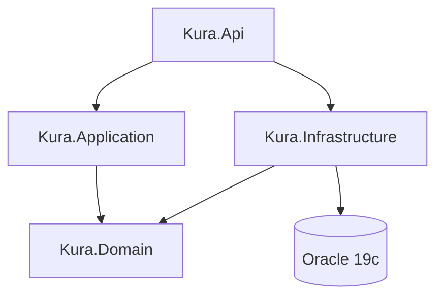

# KURA API

Backend clínico do sistema de gestão veterinária **Clyvo Vet**. Desenvolvido em .NET 10.0 como parte do Challenge FIAP 2026.

## Stack

| Tecnologia | Versão | Finalidade |
|---|---|---|
| .NET | 10.0 | Framework principal |
| ASP.NET Core | 10.0 | Web API |
| Entity Framework Core | 10.x | ORM / migrations |
| Oracle 19c | — | Banco de dados |
| FluentValidation | 12.x | Validação de DTOs |
| BCrypt.Net | — | Hash de senhas |
| JWT Bearer | — | Autenticação |
| Serilog | — | Logging estruturado |
| Docker | — | Containerização |
| Azure VM Linux | Ubuntu 22.04 | Hospedagem em produção |

## Arquitetura

Clean Architecture em 4 camadas — `Api → Application → Domain ← Infrastructure`.


```mermaid
graph TD
    A[Kura.Api] --> B[Kura.Application]
    A --> C[Kura.Infrastructure]
    B --> D[Kura.Domain]
    C --> D
    C --> E[(Oracle 19c)]
```

| Camada | Responsabilidade |
|---|---|
| **Domain** | Entidades, interfaces de repositório, exceções de domínio |
| **Application** | Services, DTOs, validadores FluentValidation |
| **Infrastructure** | EF Core, repositórios, configurações Fluent API |
| **Api** | Controllers HTTP, filtros, middlewares |

## Como rodar localmente (sem Docker)

```bash
git clone <url-do-repo>
cd backend-clinica-dotnet
```

Criar `src/Kura.Api/appsettings.Development.json` com a connection string Oracle FIAP:

```json
{
  "ConnectionStrings": {
    "DefaultConnection": "User Id=RM562999;Password=<sua-senha>;Data Source=oracle.fiap.com.br:1521/orcl"
  },
  "Jwt": {
    "Key": "kura-api-secret-key-fiap-2026-clyvovet",
    "Issuer": "kura-api",
    "Audience": "kura-client"
  },
  "IoT": {
    "ApiKey": "kura-iot-device-key-2026"
  }
}
```

```bash
dotnet restore
dotnet run --project src/Kura.Api
# Swagger: http://localhost:5000/swagger
```

## Como rodar com Docker

```bash
docker-compose up --build
# Swagger: http://localhost:8080/swagger
# Health:  http://localhost:8080/health
```

A API conecta ao Oracle externo da FIAP (`oracle.fiap.com.br`). Nenhum banco local é necessário.

---

## Como testar autenticação

1. **Criar clínica** — `POST /api/v1/auth/register-clinica` (sem token)
2. **Fazer login** — `POST /api/v1/auth/login` → copiar o campo `token` da resposta
3. **Autorizar no Swagger** — clicar em **Authorize** e preencher `Bearer {token}`
4. Todos os endpoints com cadeado agora funcionam

```bash
# Exemplo via curl
TOKEN=$(curl -s -X POST http://localhost:8080/api/v1/auth/login \
  -H "Content-Type: application/json" \
  -d '{"dsEmail":"admin@clinica.com","dsSenha":"Senha123!"}' \
  | jq -r '.token')

curl -H "Authorization: Bearer $TOKEN" http://localhost:8080/api/v1/tutores
```

## Contextos de autenticação

| Contexto | Mecanismo | Quem usa |
|---|---|---|
| Front da clínica | JWT Bearer (`Authorization: Bearer {token}`) | Veterinários, gestores |
| Dispositivos IoT (ESP32) | API Key (`X-Api-Key: {key}`) | Sensores de temperatura |
| IA Luna (Python) | API Key (`X-Api-Key: {key}`) | Chatbot de triagem |

---

## Endpoints

### Auth
| Método | Rota | Descrição | Auth |
|---|---|---|---|
| POST | `/api/v1/auth/login` | Autenticação — retorna JWT | Público |
| POST | `/api/v1/auth/register-clinica` | Cadastro de nova clínica | Público |

### Clínicas
| Método | Rota | Descrição | Auth |
|---|---|---|---|
| GET | `/api/v1/clinicas/{id}` | Buscar clínica por ID | JWT |
| PUT | `/api/v1/clinicas/{id}` | Atualizar clínica | JWT |
| DELETE | `/api/v1/clinicas/{id}` | Soft delete da clínica | JWT |

### Veterinários
| Método | Rota | Descrição | Auth |
|---|---|---|---|
| GET | `/api/v1/veterinarios` | Listar veterinários | JWT |
| GET | `/api/v1/veterinarios/{id}` | Buscar por ID | JWT |
| POST | `/api/v1/veterinarios` | Cadastrar veterinário | JWT |
| PUT | `/api/v1/veterinarios/{id}` | Atualizar veterinário | JWT |
| DELETE | `/api/v1/veterinarios/{id}` | Soft delete | JWT |

### Tutores
| Método | Rota | Descrição | Auth |
|---|---|---|---|
| GET | `/api/v1/tutores` | Listar tutores (busca por nome/CPF) | JWT |
| GET | `/api/v1/tutores/{id}` | Buscar por ID | JWT |
| GET | `/api/v1/tutores/{id}/pets` | Pets do tutor | JWT |
| POST | `/api/v1/tutores` | Criar tutor + invite de onboarding (UUID, 7 dias) | JWT |
| PUT | `/api/v1/tutores/{id}` | Atualizar tutor | JWT |

> **POST /tutores** retorna `TutorComInviteResponseDto` com o token do invite e canal (WHATSAPP \| EMAIL \| SMS).

### Pets
| Método | Rota | Descrição | Auth |
|---|---|---|---|
| GET | `/api/v1/pets` | Listar pets (filtros: tutorId, especieId, porte) | JWT |
| GET | `/api/v1/pets/{id}` | Buscar por ID | JWT |
| POST | `/api/v1/pets` | Cadastrar pet | JWT |
| PUT | `/api/v1/pets/{id}` | Atualizar pet | JWT |
| DELETE | `/api/v1/pets/{id}` | Soft delete | JWT |
| POST | `/api/v1/pets/{id}/tutores` | Vincular tutor adicional (N:N) | JWT |
| GET | `/api/v1/pets/{id}/timeline` | Timeline cronológica de eventos | JWT |
| GET | `/api/v1/pets/{id}/proximas-vacinas` | Próximas doses agendadas | JWT |

### Eventos Clínicos
| Método | Rota | Descrição | Auth |
|---|---|---|---|
| GET | `/api/v1/eventos-clinicos` | Listar eventos (filtros: petId, tipo, datas, veterinárioId) | JWT |
| GET | `/api/v1/eventos-clinicos/{id}` | Buscar por ID | JWT |
| POST | `/api/v1/eventos-clinicos/vacinas` | Registrar vacina (EventoClinico + Vacina atômico) | JWT |
| POST | `/api/v1/eventos-clinicos/prescricoes` | Registrar prescrição | JWT |
| POST | `/api/v1/eventos-clinicos/exames` | Registrar exame | JWT |
| POST | `/api/v1/eventos-clinicos/consultas` | Registrar consulta clínica | JWT |

### Agenda
| Método | Rota | Descrição | Auth |
|---|---|---|---|
| GET | `/api/v1/agenda?dataInicio=&dataFim=&veterinarioId=` | Agenda do intervalo (máx. 31 dias, leitura de AGENDAMENTO Java) | JWT |
| PATCH | `/api/v1/agendamentos/{id}/status` | Atualizar status com controle de concorrência otimista (NrVersion) | JWT |

> **PATCH /agendamentos/{id}/status** aceita `{ "dsStatus": "REALIZADO|CANCELADO", "nrVersion": N }`.  
> Retorna **409** se `nrVersion` desatualizado — atualize e reenvie.

### Luna (IA de triagem)
| Método | Rota | Descrição | Auth |
|---|---|---|---|
| GET | `/api/v1/luna/triagens/relatorio?dataInicio=&dataFim=` | Relatório agregado de triagens | JWT |

### Dashboard
| Método | Rota | Descrição | Auth |
|---|---|---|---|
| GET | `/api/v1/dashboard/hoje` | Resumo do dia atual | JWT |
| GET | `/api/v1/dashboard/alertas` | Alertas ativos | JWT |
| GET | `/api/v1/dashboard/recentes` | Agendamentos recentes | JWT |

### Notificações
| Método | Rota | Descrição | Auth |
|---|---|---|---|
| GET | `/api/v1/notificacoes` | Listar notificações da clínica | JWT |
| PATCH | `/api/v1/notificacoes/{id}/marcar-lida` | Marcar como lida | JWT |

### IoT
| Método | Rota | Descrição | Auth |
|---|---|---|---|
| POST | `/api/v1/iot/leituras` | Ingerir leitura de temperatura | API Key |
| GET | `/api/v1/iot/dispositivos` | Listar dispositivos | API Key |
| GET | `/api/v1/iot/dispositivos/{id}/leituras` | Histórico de leituras | API Key |
| GET | `/api/v1/iot/dispositivos/{id}/status` | Status do dispositivo | API Key |
| GET | `/api/v1/iot/alertas` | Listar alertas de temperatura | API Key |

### Medicamentos
| Método | Rota | Descrição | Auth |
|---|---|---|---|
| GET | `/api/v1/medicamentos?busca=&page=&pageSize=` | Listar medicamentos paginados | JWT |
| GET | `/api/v1/medicamentos/{id}` | Buscar por ID | JWT |
| POST | `/api/v1/medicamentos` | Cadastrar medicamento | JWT |

### Métricas (SLO)
| Método | Rota | Descrição | Auth |
|---|---|---|---|
| GET | `/metrics` | Métricas operacionais para SLO tracking | Público |

### Health
| Método | Rota | Descrição | Auth |
|---|---|---|---|
| GET | `/health` | Health check da API | Público |

---

## Variáveis de ambiente

| Variável | Descrição | Exemplo |
|---|---|---|
| `ConnectionStrings__DefaultConnection` | String de conexão Oracle | `User Id=RM562999;Password=...;Data Source=host:1521/orcl` |
| `Jwt__Key` | Chave secreta para assinar o JWT | `kura-api-secret-key-fiap-2026-clyvovet` |
| `Jwt__Issuer` | Emissor do token JWT | `kura-api` |
| `Jwt__Audience` | Audiência do token JWT | `kura-client` |
| `IoT__ApiKey` | Chave de autenticação dos dispositivos IoT | `kura-iot-device-key-2026` |
| `ASPNETCORE_ENVIRONMENT` | Ambiente de execução | `Development` / `Production` |

## Deploy

Consulte [`docs/deploy/README.md`](docs/deploy/README.md) para o passo a passo completo de provisionamento de VM Linux na Azure e deploy via Docker.

## Equipe — Clyvo Vet

| Membro | Função |
|---|---|
| **Felipe Ferrete** *(líder técnico)* | .NET · IoT/IA |
| **Nikolas Brisola** | Java · Backend Tutor |
| **Guilherme Sola** | Mobile Tutor · UX |
| **Gustavo Bosak** | Mobile Clínica · QA |
| **Clayton** | DevOps · BD |
