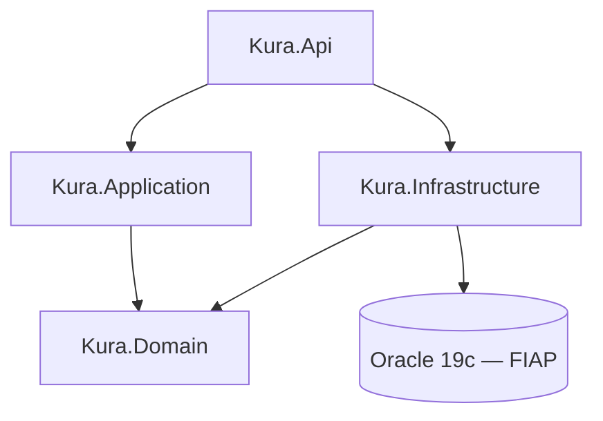

# KURA API — Backend Clínica


Hub clínico do ecossistema **Clyvo Vet** — sistema integrado de gestão veterinária desenvolvido como Challenge FIAP 2026. Expõe a API RESTful responsável pelo domínio clínico: prontuários, eventos, agenda, IoT de temperatura e integração com a IA Luna de triagem.

---

## Sumário

1. [Arquitetura](#arquitetura)
2. [Primeiros Passos](#primeiros-passos)
3. [Configuração de Ambiente](#configuração-de-ambiente)
4. [Execução Local](#execução-local)
5. [Execução via Docker](#execução-via-docker)
6. [Autenticação](#autenticação)
7. [Índice de Endpoints](#índice-de-endpoints)
8. [Índice de Artefatos — Avaliadores FIAP](#índice-de-artefatos--avaliadores-fiap)
9. [Variáveis de Ambiente](#variáveis-de-ambiente)
10. [Equipe](#equipe)

---

## Arquitetura

Clean Architecture em 4 camadas com separação estrita de responsabilidades:

```
Api  ──►  Application  ──►  Domain
 │                             ▲
 └──────  Infrastructure  ─────┘
```


```mermaid
graph TD
    A[Kura.Api] --> B[Kura.Application]
    A --> C[Kura.Infrastructure]
    B --> D[Kura.Domain]
    C --> D
    C --> E[(Oracle 19c — FIAP)]
```

| Camada | Responsabilidade |
|---|---|
| **Kura.Domain** | Entidades, interfaces de repositório, exceções de domínio. Zero dependências externas. |
| **Kura.Application** | Serviços de orquestração, DTOs, validadores FluentValidation. |
| **Kura.Infrastructure** | EF Core `KuraDbContext`, repositórios, configurações Fluent API, interceptors. |
| **Kura.Api** | Controllers HTTP, filtros de autenticação, middlewares. Nenhuma lógica de negócio. |

### Padrões arquiteturais relevantes

- **Repository + Unit of Work** — `IRepository<T>` / `IUnitOfWork` definidos no Domain, implementados na Infrastructure. Um único `CommitAsync()` por operação de serviço.
- **Multi-tenancy implícita** — `IClinicaContext` injeta `ID_CLINICA` do JWT em `HasQueryFilter` global. Endpoints públicos recebem `IdClinicaFiltro = null`, contornando o filtro intencionalmente.
- **Soft delete** — todas as entidades herdam `EntidadeBase` (`StAtiva`, `DtCriacao`, `DtAtualizacao`). Filtro global em `StAtiva`.
- **Bool → CHAR(1)** — conversor global `BoolToSimNaoConverter` mapeia `bool`/`bool?` para `'S'`/`'N'` (schema Oracle).
- **Read-only via interceptor** — `ReadOnlyTablesInterceptor` rejeita qualquer `Add`/`Update`/`Delete` contra `ContaTutor` e `Consentimento` (domínio Java).
- **Concorrência otimista** — `Agendamento` usa coluna `NrVersion`; conflito retorna HTTP 409.

---

## Primeiros Passos

### Pré-requisitos

| Ferramenta | Versão mínima |
|---|---|
| .NET SDK | 10.0 |
| Docker + Docker Compose | 24.x |
| Acesso Oracle FIAP | `oracle.fiap.com.br:1521/orcl` |

### Clonar o repositório

```bash
git clone https://github.com/KURA-Clyvo/backend-clinica-dotnet.git
cd backend-clinica-dotnet
```

---

## Configuração de Ambiente

> **Política de segredos**: jamais commite credenciais. O arquivo `appsettings.Development.json` está no `.gitignore`. Use variáveis de ambiente ou o mecanismo de User Secrets do .NET para desenvolvimento local.

### Opção A — User Secrets (recomendado para desenvolvimento local)

```bash
dotnet user-secrets init --project src/Kura.Api
dotnet user-secrets set "ConnectionStrings:DefaultConnection" \
  "User Id=RM562999;Password=<YOUR_ORACLE_PASSWORD>;Data Source=oracle.fiap.com.br:1521/orcl" \
  --project src/Kura.Api
dotnet user-secrets set "Jwt:Key" "<YOUR_JWT_SECRET_MIN_32_CHARS>" --project src/Kura.Api
dotnet user-secrets set "Jwt:Issuer" "kura-api" --project src/Kura.Api
dotnet user-secrets set "Jwt:Audience" "kura-client" --project src/Kura.Api
dotnet user-secrets set "IoT:ApiKey" "<YOUR_IOT_API_KEY>" --project src/Kura.Api
dotnet user-secrets set "Luna:ApiKey" "<YOUR_LUNA_API_KEY>" --project src/Kura.Api
```

### Opção B — `appsettings.Development.json` (local, nunca versionado)

Crie `src/Kura.Api/appsettings.Development.json`:

```json
{
  "ConnectionStrings": {
    "DefaultConnection": "User Id=RM562999;Password=<YOUR_ORACLE_PASSWORD>;Data Source=oracle.fiap.com.br:1521/orcl"
  },
  "Jwt": {
    "Key": "<YOUR_JWT_SECRET_MIN_32_CHARS>",
    "Issuer": "kura-api",
    "Audience": "kura-client",
    "ExpiresInHours": 8
  },
  "IoT": { "ApiKey": "<YOUR_IOT_API_KEY>" },
  "Luna": { "ApiKey": "<YOUR_LUNA_API_KEY>" }
}
```

### Opção C — `.env` para Docker Compose

```bash
cp .env.example .env
# edite .env e preencha os valores reais
```

---

## Execução Local

```bash
dotnet restore
dotnet build
dotnet run --project src/Kura.Api
# Swagger UI: http://localhost:5000/swagger  (apenas ambiente Development)
# Health:     http://localhost:5000/health
# Metrics:    http://localhost:5000/metrics
```

### Testes

```bash
dotnet test                                                        # todos os projetos
dotnet test --filter "FullyQualifiedName~NomeDoServico"            # filtrar por classe
```

---

## Execução via Docker

```bash
docker-compose up --build
# Swagger UI: http://localhost:8080/swagger
# Health:     http://localhost:8080/health
# Metrics:    http://localhost:8080/metrics
```

A API conecta ao Oracle externo da FIAP. Nenhum banco de dados local é necessário.

---

## Autenticação

| Contexto | Mecanismo | Consumidor |
|---|---|---|
| Front da clínica | JWT Bearer — `Authorization: Bearer {token}` | Veterinários e gestores |
| Dispositivos IoT (ESP32) | API Key — `X-Api-Key: {key}` | Sensores de temperatura |
| IA Luna (Python) | API Key — `X-Api-Key: {key}` | Chatbot de triagem |

> A linha "IA Luna" acima documenta o par `Luna:ApiKey`/`LUNA_API_KEY` — a chave que a
> Luna manda (`Authorization: Bearer` hoje, migrando para `X-Api-Key` na TASK-68) para
> autenticar suas chamadas *para* este backend (`GET /tutores/telefone/{numero}`,
> `POST /luna/interactions`, `POST /luna/triage` — TASK-67). **Não confundir** com
> `Luna:InboundApiKey`/`LUNA_INBOUND_API_KEY`, usada na direção oposta (este backend →
> Luna, `POST /transcricao`, FEAT-02). São duas chaves/direções diferentes mesmo
> compartilhando o prefixo `Luna:` na config.

### Fluxo de autenticação JWT

```
1. POST /api/v1/auth/register-clinica   →  cria clínica (sem token)
2. POST /api/v1/auth/login              →  retorna { "token": "..." }
3. Swagger → Authorize → Bearer {token}
```

```bash
TOKEN=$(curl -s -X POST http://localhost:8080/api/v1/auth/login \
  -H "Content-Type: application/json" \
  -d '{"dsEmail":"admin@clinica.com","dsSenha":"Senha123!"}' \
  | jq -r '.token')

curl -H "Authorization: Bearer $TOKEN" http://localhost:8080/api/v1/tutores
```

---

## Índice de Endpoints

### Auth

| Método | Rota | Descrição | Auth |
|---|---|---|---|
| POST | `/api/v1/auth/login` | Autenticação — retorna JWT | Público |
| POST | `/api/v1/auth/register-clinica` | Cadastro de nova clínica | Público |

### Clínicas

| Método | Rota | Descrição | Auth |
|---|---|---|---|
| GET | `/api/v1/clinicas/{id}` | Buscar clínica por ID | JWT |
| PUT | `/api/v1/clinicas/{id}` | Atualizar clínica | JWT |
| DELETE | `/api/v1/clinicas/{id}` | Soft delete da clínica | JWT |

### Veterinários

| Método | Rota | Descrição | Auth |
|---|---|---|---|
| GET | `/api/v1/veterinarios` | Listar veterinários | JWT |
| GET | `/api/v1/veterinarios/{id}` | Buscar por ID | JWT |
| POST | `/api/v1/veterinarios` | Cadastrar veterinário | JWT |
| PUT | `/api/v1/veterinarios/{id}` | Atualizar veterinário | JWT |
| DELETE | `/api/v1/veterinarios/{id}` | Soft delete | JWT |

### Tutores

| Método | Rota | Descrição | Auth |
|---|---|---|---|
| GET | `/api/v1/tutores` | Listar tutores (busca por nome/CPF) | JWT |
| GET | `/api/v1/tutores/{id}` | Buscar por ID | JWT |
| GET | `/api/v1/tutores/{id}/pets` | Pets vinculados ao tutor | JWT |
| GET | `/api/v1/tutores/telefone/{numero}` | Contexto do tutor (clínica + pets) pelo WhatsApp — consumido pela IA Luna (TASK-67) | API Key |
| POST | `/api/v1/tutores` | Criar tutor + invite de onboarding (retorna `TutorComInviteResponseDto` com token UUID válido por 7 dias e canal WHATSAPP \| EMAIL \| SMS) | JWT |
| PUT | `/api/v1/tutores/{id}` | Atualizar tutor | JWT |

### Pets

| Método | Rota | Descrição | Auth |
|---|---|---|---|
| GET | `/api/v1/pets` | Listar pets (filtros: `tutorId`, `especieId`, `porte`) | JWT |
| GET | `/api/v1/pets/{id}` | Buscar por ID | JWT |
| POST | `/api/v1/pets` | Cadastrar pet | JWT |
| PUT | `/api/v1/pets/{id}` | Atualizar pet | JWT |
| DELETE | `/api/v1/pets/{id}` | Soft delete | JWT |
| POST | `/api/v1/pets/{id}/tutores` | Vincular tutor adicional (N:N) | JWT |
| GET | `/api/v1/pets/{id}/timeline` | Timeline cronológica de eventos clínicos | JWT |
| GET | `/api/v1/pets/{id}/proximas-vacinas` | Próximas doses agendadas | JWT |

### Eventos Clínicos

> Cada POST cria `EventoClinico` + subtipo atomicamente em um único `CommitAsync()`.

| Método | Rota | Descrição | Auth |
|---|---|---|---|
| GET | `/api/v1/eventos-clinicos` | Listar (filtros: `petId`, `tipo`, `dataInicio`, `dataFim`, `veterinarioId`) | JWT |
| GET | `/api/v1/eventos-clinicos/{id}` | Buscar por ID | JWT |
| POST | `/api/v1/eventos-clinicos/vacinas` | Registrar vacina | JWT |
| POST | `/api/v1/eventos-clinicos/prescricoes` | Registrar prescrição | JWT |
| POST | `/api/v1/eventos-clinicos/exames` | Registrar exame | JWT |
| POST | `/api/v1/eventos-clinicos/consultas` | Registrar consulta clínica | JWT |

### Agenda

| Método | Rota | Descrição | Auth |
|---|---|---|---|
| GET | `/api/v1/agenda?dataInicio=&dataFim=&veterinarioId=` | Agenda do intervalo (máx. 31 dias; leitura da tabela Java `AGENDAMENTO`) | JWT |
| PATCH | `/api/v1/agendamentos/{id}/status` | Atualizar status com concorrência otimista via `NrVersion` | JWT |

> PATCH aceita `{ "dsStatus": "REALIZADO|CANCELADO", "nrVersion": N }`. Retorna **409** se `nrVersion` estiver desatualizado.

### Luna (IA de Triagem)

| Método | Rota | Descrição | Auth |
|---|---|---|---|
| GET | `/api/v1/luna/triagens/relatorio?dataInicio=&dataFim=` | Relatório agregado de triagens geradas pelo chatbot | JWT |
| POST | `/api/v1/luna/interactions` | Registra interação de canal (WhatsApp/e-mail/SMS) recebida/enviada pela Luna (TASK-67) | API Key |
| POST | `/api/v1/luna/triage` | Registra resultado de triagem de IA, ligado à interação de origem (TASK-67) | API Key |

### Dashboard

| Método | Rota | Descrição | Auth |
|---|---|---|---|
| GET | `/api/v1/dashboard/hoje` | Resumo do dia atual | JWT |
| GET | `/api/v1/dashboard/alertas` | Alertas ativos | JWT |
| GET | `/api/v1/dashboard/recentes` | Agendamentos recentes | JWT |

### Notificações

| Método | Rota | Descrição | Auth |
|---|---|---|---|
| GET | `/api/v1/notificacoes` | Listar notificações da clínica | JWT |
| PATCH | `/api/v1/notificacoes/{id}/marcar-lida` | Marcar como lida | JWT |

### IoT

| Método | Rota | Descrição | Auth |
|---|---|---|---|
| POST | `/api/v1/iot/leituras` | Ingerir leitura de temperatura de sensor ESP32 | API Key |
| GET | `/api/v1/iot/dispositivos` | Listar dispositivos registrados | API Key |
| GET | `/api/v1/iot/dispositivos/{id}/leituras` | Histórico de leituras do dispositivo | API Key |
| GET | `/api/v1/iot/dispositivos/{id}/status` | Status atual do dispositivo | API Key |
| GET | `/api/v1/iot/alertas` | Listar alertas de temperatura | API Key |

### Medicamentos

| Método | Rota | Descrição | Auth |
|---|---|---|---|
| GET | `/api/v1/medicamentos?busca=&page=&pageSize=` | Listar medicamentos paginados | JWT |
| GET | `/api/v1/medicamentos/{id}` | Buscar por ID | JWT |
| POST | `/api/v1/medicamentos` | Cadastrar medicamento | JWT |

### Métricas e Saúde

| Método | Rota | Descrição | Auth |
|---|---|---|---|
| GET | `/metrics` | Métricas operacionais para acompanhamento de SLO | Público |
| GET | `/health` | Health check da API | Público |

---

## Índice de Artefatos — Avaliadores FIAP

Esta seção mapeia cada artefato técnico avaliável à sua localização exata no repositório.

| Artefato | Localização |
|---|---|
| **Controllers HTTP (API Layer)** | `src/Kura.Api/Controllers/` |
| **Middlewares e Filtros** | `src/Kura.Api/Middlewares/` · `src/Kura.Api/Filters/` |
| **Serviços de Aplicação** | `src/Kura.Application/Services/` |
| **DTOs e Validadores FluentValidation** | `src/Kura.Application/DTOs/` · `src/Kura.Application/Validators/` |
| **Entidades de Domínio** | `src/Kura.Domain/Entities/` |
| **Interfaces de Repositório e Exceções** | `src/Kura.Domain/Interfaces/` · `src/Kura.Domain/Exceptions/` |
| **DbContext e Configuração EF Core** | `src/Kura.Infrastructure/Persistence/KuraDbContext.cs` |
| **Implementações de Repositório** | `src/Kura.Infrastructure/Persistence/Repositories/` |
| **Fluent API — Mapeamento de Entidades** | `src/Kura.Infrastructure/Persistence/Configurations/` |
| **Interceptors (Read-only, Concorrência)** | `src/Kura.Infrastructure/Persistence/Interceptors/` |
| **Conversor Bool → CHAR(1)** | `src/Kura.Infrastructure/Persistence/Converters/BoolToSimNaoConverter.cs` |
| **Histórico de Migrations EF Core (V1–V9)** | `src/Kura.Infrastructure/Migrations/` |
| **Testes de Unidade — Application** | `tests/Kura.Application.Tests/` |
| **Testes de Domínio** | `tests/Kura.Domain.Tests/` |
| **Testes de Política — Infrastructure** | `tests/Kura.Infrastructure.Tests/` |
| **Configuração local (não versionada)** | `src/Kura.Api/appsettings.Development.json` |
| **Provisionamento Docker** | `Dockerfile` · `docker-compose.yml` |
| **Scripts de Deploy Azure (VM Linux)** | `docs/deploy/deploy-kura-vm.sh` |
| **Script de Teardown Azure** | `docs/deploy/teardown-kura.sh` |
| **Guia de Deploy** | `docs/deploy/README.md` |

---

## Variáveis de Ambiente

Consulte `.env.example` na raiz do repositório para o template completo.

| Variável | Descrição |
|---|---|
| `ConnectionStrings__DefaultConnection` | String de conexão Oracle 19c |
| `Jwt__Key` | Chave secreta para assinatura JWT (mínimo 32 caracteres) |
| `Jwt__Issuer` | Emissor do token JWT |
| `Jwt__Audience` | Audiência do token JWT |
| `IoT__ApiKey` | Chave de autenticação dos dispositivos ESP32 |
| `Luna__ApiKey` | Chave de autenticação do chatbot Luna (Python) |
| `ASPNETCORE_ENVIRONMENT` | `Development` (local) · `Production` (Azure) |

**URL de produção (Azure App Service):** `https://kura-api-fiap.azurewebsites.net`

---

## Equipe

| Membro | RM | Área de Responsabilidade |
|---|---|---|
| **Felipe Ferrete** *(Tech Lead)* | RM562999 | .NET · IoT · IA |
| **Nikolas Brisola** | RM564371 | Java · Backend Tutor |
| **Guilherme Sola** | RM563674 | Mobile Tutor · UX |
| **Gustavo Bosak** | RM566315 | Mobile Clínica · QA |
| **Clayton Alves** | RM562285 | DevOps · BD |

**Divisão técnica:** Felipe Ferrete atuou como arquiteto e desenvolvedor principal do componente .NET clínico, sendo responsável pelo design das quatro camadas Clean Architecture, implementação das configurações Fluent API, mapeamentos de entidades Oracle, restrições de tabelas read-only via interceptor, controle de concorrência otimista no `Agendamento`, integração IoT/ESP32 e hooks de sincronização cross-API com os backends Java e Python.
